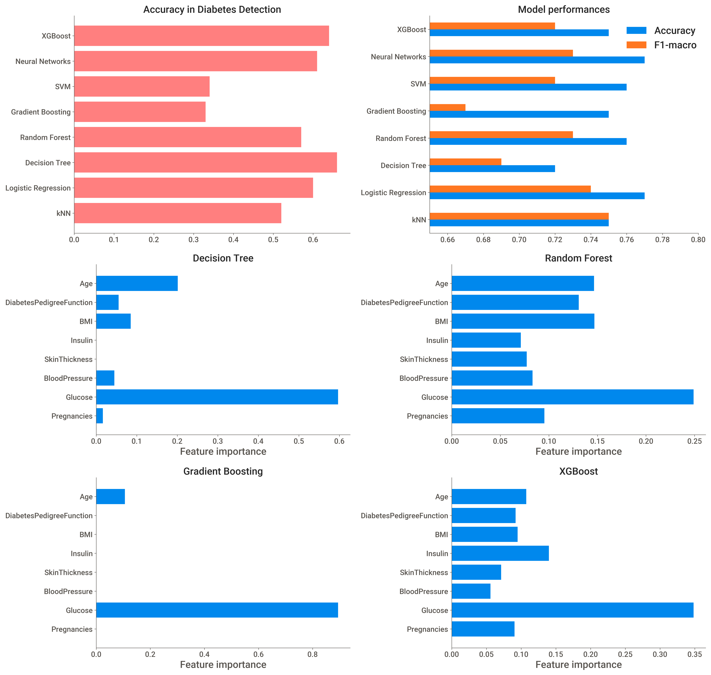

# Diabetes classification 

The dataset contains 8 medical conditions features **(X)** : 

`Pregnancies`, `Glucose`, `BloodPressure`, `SkinThickness`, `Insulin`,
       `BMI`, `DiabetesPedigreeFunction`, `Age`

`Outcome` is present a binary target **(y)** label 

>0 : Diabetes **False**

>1 : Diabetes **True**

dimension of diabetes data: **(768, 9)**
 * Dataset is small but well labeled. There are no null values present.
 * very suitable to supervised machine learning formulation.
 * This is a binary classification problem, where we have 2 classes in the target **(y)** (i.e.`df['Outcome']`) and the medical conditions can be used as the feature (**X**).
 
  
 
 # Machine-Learning Models
 
 I have used 8 different machine learning classifiers to diabetes classfication : 
 * K-Nearest Neighbors (kNN)
 * Logistic regression 
 * Decision Tree
 * Random Forest
 * Gradient Boosting
 * Support Vector Machine (SVM)
 * Neural Networks (Multi-level Perceptron : MLP)
 * XGBoost
 
 **Results are Shown below** 
 
  
  
    # Confusion Matricies
  
   
   
   # Conclusion 
   
   * **Logistic regression** and **Neural Netowrks** seems to provide the best performance based on **10-fold cross validation** of the dataset. **Logistic regression** achieves a higher *F1-score* as well, which is better metric for model evalution.
* From the confusion matricies, decision tree has the highest success in detecting the diabetes.
* **Feature selection** suggests the `Glucose` is the most crucial factor for the successful prediction of diabetes. 

 # Dashboard
 
 
 
 
